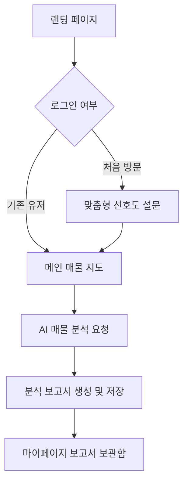

# 🏡 ijip-naejip (이제집) - Frontend 🖥️

본 저장소는 사용자 라이프스타일 맞춤형 부동산 분석 및 시각화 서비스인 **ijip-naejip**의 프론트엔드 소스코드입니다. 가독성 높은 인터페이스와 강력한 데이터 시각화 도구를 통해 복잡한 부동산 정보를 한눈에 파악할 수 있도록 돕습니다.

---

## ✨ 핵심 기능 (Key Features)

### 1. 🎯 맞춤형 선호도 설문 (Lifestyle Survey)
사용자의 예산, 출퇴근 위치, 관심 지역 등 라이프스타일 데이터를 수집하여 최적의 매물을 추천하는 기반을 마련합니다.
- **예산 범위 설정**: 슬라이더를 통한 직관적인 예산 구간 선택
- **관심 지역 태깅**: 멀티 선택을 통한 다중 관심 구역 설정
- **출퇴근 경로 분석**: 직장 위치 기반의 매물 필터링 연동

### 2. 📍 인터랙티브 지도 & 실시간 검색
카카오 지도를 활용하여 최신 아파트 실거래가 데이터를 시각화합니다.
- **클러스터링 & 마커**: 방대한 매물 데이터를 클러스터링하여 쾌적한 지도 경험 제공
- **영역 기반 검색**: 드래그/줌 인에 따라 현재 지도 화면 내 매물 실시간 업데이트
- **상세 필터**: 평형, 가격, 거래 유형별 동적 필터링 시스템

### 3. 🤖 AI 부동산 정밀 분석 (AI Reporting)
OpenAI의 강력한 언어 모델을 활용하여 매물을 다각도로 분석합니다.
- **실시간 AI 챗봇**: 매물에 대한 궁금증을 즉시 해결하는 사이드바 인터페이스
- **자동 리포트 생성**: 상담 내용을 바탕으로 마크다운 형식의 정밀 분석 보고서 생성
- **내보내기 기능**: `html2pdf.js`를 이용한 분석 결과 PDF 저장 지원

### 4. 📊 데이터 시각화 (Charts & Stats)
**D3.js**를 사용하여 복잡한 시세 변화를 직관적인 차트로 제공합니다.
- **시세 추이 그래프**: 기간별 거래가 변동 추이를 선형 그래프로 시각화
- **매물 비교 분석**: 선택한 아파트 간의 스펙 및 시세 차이를 비교 차트로 제공

---

## 🛠️ Tech Stack

| Layer | Technology |
| :--- | :--- |
| **Framework** | **Vue.js 3** (Composition API) |
| **Language** | **TypeScript** |
| **Build Tool** | **Vite** |
| **State** | **Pinia** (Persistent State) |
| **Routing** | **Vue Router** |
| **Visualization** | **D3.js**, **Kakao Maps API** |
| **Icons** | **Lucide Vue Next** |
| **API Client** | **Axios** |

---

## 📁 Project Architecture

```bash
src/
├── api/            # Backend REST API 통신 모듈
├── assets/         # 전역 스타일 및 정적 이미지 (SVG 등)
├── components/     # 재사용 가능한 UI 컴포넌트
│   └── features/   # 지도, AI, 설문 등 도메인별 핵심 기능
├── composables/    # 공통 비즈니스 로직 (Hooks)
├── router/         # Vue Router 설정 및 미들웨어
├── stores/         # Pinia를 이용한 데이터 상태 관리
├── utils/          # 날짜 형식, 지도 로더 등 유틸리티 함수
└── views/          # 페이지 단위 뷰 컴포넌트 (Landing, Market, Survey 등)
```

---

## 🔄 서비스 흐름 (Service Workflow)



---

## 🏗️ Project Architecture

```bash
src/
├── api/            # Backend REST API 통신 모듈 (Axios 인터셉터 기반)
├── assets/         # CSS 변수 및 Global 스타일 시트
├── components/     # 도메인별 기능 컴포넌트
│   └── features/   # Map, AI, Preference Survey 핵심 로직
├── stores/         # Pinia를 이용한 전역 상태 (Auth, Market, UI 등)
├── utils/          # 카카오 맵 로더 및 문자열 포맷터
└── views/          # 라우팅 중심의 페이지 뷰
```

---

## 🎨 Design System & UX
- **Modern & Clean UI**: 사용자 집중도를 높이는 다크/라이트 모드 최적화
- **Interactive Feedback**: 모든 상호작용에 부드러운 애니메이션 적용
- **Data Driven**: D3.js를 통한 복잡한 시세 데이터의 직관적 시각화
