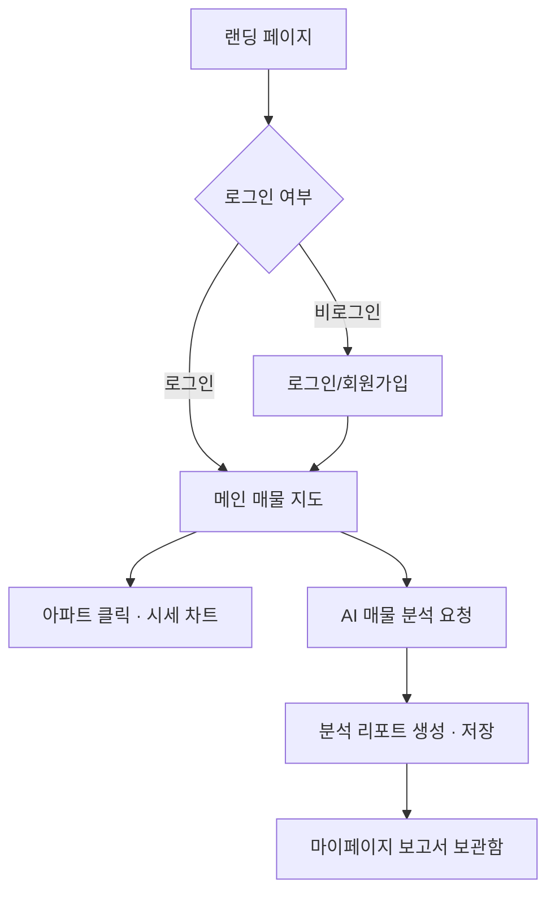

# 이집내집 (ijip-naejip) — Frontend

실거래가 데이터를 지도·차트로 시각화하고, AI 채팅으로 아파트를 분석하는 부동산 서비스의 프론트엔드입니다.

- **전체 서비스 문서**: 상위 [../README.md](../README.md) · [아키텍처](../docs/ARCHITECTURE.md)

## 핵심 기능 (Key Features)

### 1. 📍 인터랙티브 지도 & 줌 레벨별 데이터 전환
카카오 지도에 실거래가를 시각화합니다. 전국 데이터를 한 번에 마커로 그리면 브라우저가 멈추므로, **줌 레벨에 따라 서버가 집계 단위를 바꿔 내려줍니다.**

```
줌 확대 ◀──────────────────────────────▶ 줌 축소
APT_DONG(동별) → APT(단지) → DONG(행정동) → GUGUN(구군) → SIDO(시도)
```

프론트는 지도 이동 시 현재 bounding box와 줌 레벨을 보내고(`marketApi.ts`), 스코프에 맞는 마커만 렌더링합니다. 클라이언트 클러스터링 대신 이 방식을 택해 대용량에서도 렌더링 부담을 일정하게 유지합니다.

### 2. 🤖 AI 부동산 정밀 분석 (AI Reporting)
- **실시간 AI 챗봇**: 매물 궁금증을 즉시 해결하는 사이드바 인터페이스
- **자동 리포트 생성**: 상담 내용을 마크다운 형식 분석 보고서로 변환
- **PDF 내보내기**: `html2pdf.js`로 분석 결과 저장 (`AIStatsModal.vue`)

### 3. 📊 데이터 시각화 (Charts & Stats)
**D3.js**로 시세 변화를 직관적인 차트로 제공합니다.
- **시세 추이 그래프**: 기간별 거래가 변동을 라인 + 거래량 이중 차트로 시각화 (3년/6개월 필터)
- **매물 비교 분석**: 선택한 아파트 간 스펙·시세 차이를 비교 차트로 제공

### 4. 👤 인증 & 라우트 보호
- 카카오/구글 소셜 로그인, 이메일 인증 회원가입
- `requiresAuth`/`guestOnly` 라우트 메타로 접근 제어, Axios 인터셉터가 JWT 자동 주입

> 라이프스타일 선호도 설문(`PreferenceSurveyView.vue`)은 화면이 구현되어 있으나 현재 라우터에 연결되지 않은 준비 단계 기능입니다.

## 기술 스택

| Layer | Technology |
| :--- | :--- |
| Framework | Vue.js 3 (Composition API) |
| Language | TypeScript |
| Build | Vite |
| State | Pinia (auth · mainData · market · ui) |
| Routing | Vue Router (라우트 가드) |
| Visualization | D3.js · Kakao Maps API |
| Export | html2pdf.js |
| Icons | Lucide Vue Next |
| API Client | Axios (인터셉터 기반 JWT 주입) |

## 프로젝트 구조

```
src/
├── api/            # Backend REST 통신 (Axios 인터셉터, marketApi 등)
├── assets/         # 전역 스타일 · 정적 자원
├── components/
│   └── features/   # 도메인별 핵심 기능 (map, ai, ...)
├── composables/    # 재사용 로직 (지도 상태·이메일 인증 등)
├── router/         # 라우터 설정 및 가드
├── stores/         # Pinia 전역 상태
├── utils/          # 카카오맵 로더 · 포맷터
└── views/          # 페이지 뷰 (home, market, auth, settings, survey)
```

## 서비스 흐름


```mermaid
graph TD
    A[랜딩 페이지] --> B{로그인 여부}
    B -- 비로그인 --> L[로그인/회원가입]
    B -- 로그인 --> D[메인 매물 지도]
    L --> D
    D --> E[아파트 클릭 · 시세 차트]
    D --> F[AI 매물 분석 요청]
    F --> G[분석 리포트 생성 · 저장]
    G --> H[마이페이지 보고서 보관함]
```

## 디자인 & UX
- 다크/라이트 모드 지원, 반응형 레이아웃
- D3.js 기반 시세 데이터 시각화
- 지도 상태(중심·줌)를 URL 파라미터와 동기화해 링크 공유·새로고침 복원 지원
