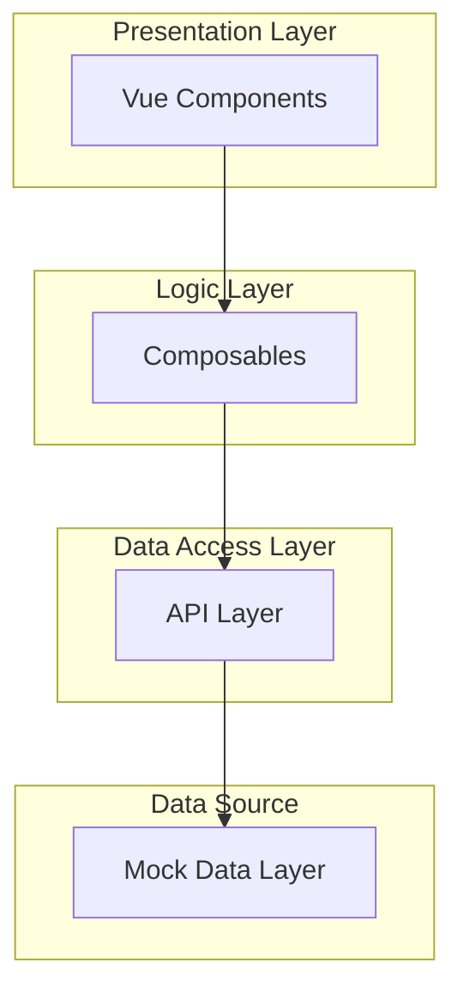

# 스토리보드 및 구현 진행 방식

이 문서는 현재 구현된 애플리케이션의 주요 사용자 흐름(Storyboard)과 구현 아키텍처(Progress Method)를 설명합니다.

## 1. 스토리보드 (User Flow)

### 1.1 로그인 (Login)
사용자는 이메일과 비밀번호를 입력하여 로그인합니다. 현재 모의 데이터(Mock Data)를 사용하여 인증 과정을 시뮬레이션합니다.

### 1.2 매물 지도 (Market Map)
로그인 후 메인 화면인 매물 지도로 이동합니다. 서울시 주요 구의 매물 정보가 지도 위에 마커로 표시됩니다.
- **구현:** `useMarket` composable을 통해 `marketApi`에서 데이터를 가져와 지도에 렌더링합니다.

### 1.3 매물 상세 정보 (Property Detail)
지도에서 마커를 클릭하면 좌측 사이드바에 해당 매물의 상세 정보가 표시됩니다.
- **기능:** 매매가, 관리비, 면적 등의 정보 확인 및 '안전도 분석' 기능 접근 가능.

### 1.4 마이페이지 (My Page)
사용자 설정 및 프로필 정보를 확인하고 수정할 수 있는 페이지입니다.
- **구현:** `useAuth` composable을 통해 현재 로그인한 사용자 정보를 표시합니다.

---

## 2. 구현 진행 방식 (Progress Method)

현재 프로젝트는 **관심사의 분리(Separation of Concerns)** 원칙에 따라 다음과 같은 계층 구조로 구현되었습니다.

### 2.1 아키텍처 구조

### 2.2 계층별 역할

1.  **Data Layer (`front/src/data`)**
    -   순수 데이터 및 데이터 생성 로직을 담당합니다.
    -   예: `marketData.ts` (매물 생성), `authData.ts` (사용자 데이터)

2.  **API Layer (`front/src/api`)**
    -   데이터 레이어와 통신하며, 향후 실제 백엔드 API로 교체될 지점입니다.
    -   `Promise`와 `setTimeout`을 사용하여 비동기 네트워크 통신을 흉내냅니다.
    -   예: `marketApi.ts`, `authApi.ts`

3.  **Composables (`front/src/composables`)**
    -   Vue의 반응형 상태(State)와 비즈니스 로직을 캡슐화합니다.
    -   컴포넌트에서 재사용 가능한 로직을 제공합니다.
    -   예: `useAuth.ts` (로그인 상태 관리), `useMarket.ts` (매물 데이터 관리)

4.  **Utils (`front/src/utils`)**
    -   상태를 가지지 않는 순수 헬퍼 함수들의 모음입니다.
    -   예: `formatters.ts` (가격 포맷팅 `10억 5000만원`)

5.  **View Components (`front/src/views`)**
    -   UI 렌더링에만 집중하며, 복잡한 로직은 Composable에 위임합니다.
    -   예: `MarketView.vue`는 `useMarket`을 호출하여 데이터를 받아오고 화면에 그리기만 합니다.

이러한 구조는 코드의 **유지보수성**을 높이고, 향후 **백엔드 연동 시 수정 범위를 최소화**할 수 있도록 설계되었습니다.
